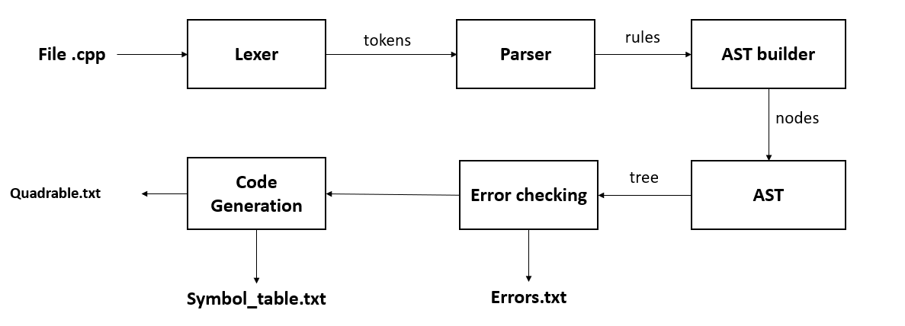
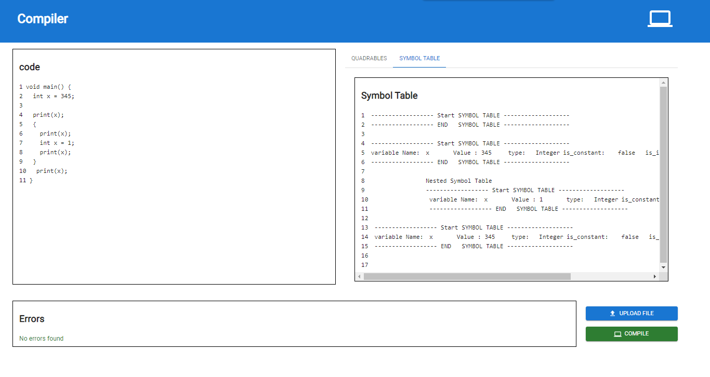
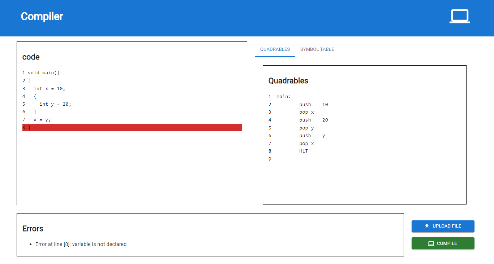

# Compiler

## 📝 Table of Contents

- [Overview](#about)
- [Features](#features)
- [Tools & Technologies](#tools)
- [How To Run](#start)
- [GUI](#GUI)
- [Tokens](#Tokens)
- [Grammer](#Grammer)
- [Quadrables](#Quadrables)

## 🚩Overview <a name = "about"></a>

- in this project we made a new and fast compiler for the `C /C++` language using `Flex` & `Bison`
- A `File.cpp` is fed to our compiler then the lexer generates the tokens → passed to our parser to generate the production rules then → it generates the following :
  - `Errors.txt` for any syntax/semantic error in the file
  - `Quadrables.txt` for the stack machine code resulted from this code
  - `SymbolTable.txt` the log of our symbol table where it saves the variables

### Pipeline



## 🚩Features <a name = "features"></a>

- variable declaration with all types `int , float , char , string , bool`
- variable assignment
- controls statements `if , switch`
- loop statements `for , while , do while` , `break` , `continue`
- functions either `void` or `return` type
- print statement
- nested scopes and blocks
  - `if` , `switch` , `for` , `while` , `do while` , `function` , `block`
- `enum` statement
- `default` statement
- `case` statement
- `const` statement
- syntax error handling
- semantic error handling
  - `undeclared variable`
  - `redeclared variable`
  - `invalid const update`
  - `un-initialized variable`
  - `un-used variable`
  - `type mismatch`
  - `invalid assignment`
    <!-- - `invalid return type`  -->
    <!-- - `invalid function call`  -->
    <!-- - `invalid function return`  -->
    <!-- - `invalid function arguments`  -->
    <!-- - `invalid function ret`  -->

## 💻Tools & Technologies <a name = "tools"></a>

- **Flex**
- **Bison**
- **C/C++**
- **GUI**
  - **React for FE**
  - **Node for BE**

## 🏁How To Run <a name = "start"></a>

```bash
make clean
make build

./compiler.exe /path/to/input/file  /path/to/out/directory
```

## 🎥GUI <a name = "GUI"></a>



---



## ✨Tokens <a name = "Tokens"></a>

### Reserved Keywords

- for the data type definitions
  - `INT_TYPE` ,`FLOAT_TYPE` , `STRING_TYPE` , `CHAR_TYPE` , `BOOL_TYPE` , `CONST`
  - `VOID`
- control statements
  - `IF` , `ELSE` , `SWITCH` ,`CASE` , `DEFAULT`
- loops
  - `FOR` , `WHILE` , `DO` , `BREAK`
- others
  - `ENUM` ,`RETURN` ,`PRINT`

### Operators

- mathematical
  - `ASSIGNMENT` , `ADD` , `SUB` , `MUL` , `DIV` , `MOD`
- logical
  - `EQUAL_TO` , `NOT_EQUAL` , `LT` `GT` , `LTE` , `GTE`
  - `AND` , `OR` , `NOT`

### Values

- `STRING_VALUE` , `CHAR_VALUE` , `INT_VALUE` `FLOAT_VALUE` `BOOL_VALUE`
- `IDENTIFIER`

## 🧾Grammer (Production Rules) <a name = "Grammer"></a>

```
program:
        program statement
    | /* Empty Statement */
    ;

statement_list:
        statement
    |   statement_list statement
    ;

data_type:
        INT_TYPE
    |   FLOAT_TYPE
    |   CHAR_TYPE
    |   BOOL_TYPE
    |   STRING_TYPE
    ;


statement:
        SEMICOLON
    |   expr SEMICOLON

    /* Declaration & Assignment */
    |   data_type IDENTIFIER SEMICOLON
    |   data_type IDENTIFIER ASSIGNMENT expr SEMICOLON
    |   CONST data_type IDENTIFIER ASSIGNMENT expr SEMICOLON
    |   IDENTIFIER ASSIGNMENT expr SEMICOLON
    |   enum_statement

    /* Loop statment */
    |   WHILE '(' expr ')' statement
    |   DO statement WHILE '(' expr ')' SEMICOLON
    |   FOR '(' IDENTIFIER ASSIGNMENT expr SEMICOLON expr SEMICOLON IDENTIFIER ASSIGNMENT expr ')' statement

    /*  IF statment*/
    |   IF '(' expr ')' statement %prec IFX
    |   IF '(' expr ')' statement ELSE statement

    /* Switch statement */
    |   SWITCH '(' IDENTIFIER ')' '
    |   BREAK SEMICOLON

    /* Print statement */
    | PRINT '(' expr ')' SEMICOLON      /* only prints variables */

    /* Function Statement */
    |   data_type IDENTIFIER function_arguements_list '
    |   VOID IDENTIFIER function_arguements_list '
    |   VOID IDENTIFIER function_arguements_list '

    /* Block Statement */
    |   '{' statement_list '}'
    |   '{'  '}'
    |   error SEMICOLON
    |   error '}'
    ;

enum_arguments:
        enum_arguments COMMA IDENTIFIER
    |   IDENTIFIER
    ;

enum_statement:
        ENUM
    ;

case_list:
        case_list CASE INT COLON statement_list
    |   case_list CASE CHAR COLON statement_list
    |   case_list CASE STRING COLON statement_list
    |   case_list CASE BOOL COLON statement_list
    |  /* Empty statement */
    ;

case_default:
        DEFAULT COLON statement_list
    ;

expr:
        INT
    |   FLOAT
    |   CHAR
    |   STRING
    |   BOOL
    |   IDENTIFIER
    |   SUB expr %prec UMINUS
    |   NOT expr

    /* Mathematical */
    |   expr ADD expr
    |   expr SUB expr
    |   expr MUL expr
    |   expr DIV expr
    |   expr MOD expr

    /* Logical */
    |   expr LT expr
    |   expr GT expr
    |   expr GTE expr
    |   expr LTE expr
    |   expr NOT_EQUAL expr
    |   expr EQUAL_TO expr
    |   expr AND expr
    |   expr OR expr

    /* function call or grouped */
    |   IDENTIFIER function_call
    |   '(' expr ')'
    ;

function_statement_list:
        RETURN expr SEMICOLON
    |   statement function_statement_list
    ;

function_arguements:
        data_type IDENTIFIER
    |   data_type IDENTIFIER COMMA function_arguements
    ;

function_arguements_list:
        '(' function_arguements ')'
    |   '(' ')'
    ;

function_arguements_call:
        expr
    |   function_arguements_call COMMA expr
    ;

function_call:
        '(' function_arguements_call ')'
    |   '(' ')'
    ;
```

## 📖Quadrables <a name = "Quadrables"></a>

| Quadrable                | Description                                                                                                                            |
| ------------------------ | -------------------------------------------------------------------------------------------------------------------------------------- |
| PUSH value               | pushes the value to stack                                                                                                              |
| POP var_name             | pops the first value from stack and stores it in var_name                                                                              |
| JMP label                | jumbs to the labelspecified                                                                                                            |
| JZ label                 | if zero_flag is set then it jumbs the label specified                                                                                  |
| NEG                      | stack_top = -1 \* stack_top (negates the stack_top)                                                                                    |
| PLUS                     | pops the top 2 operands from stack & make plus operation on them then                                                                  |
| pushes it to stack again |
| SUBTRACT                 | pops the top 2 operands from stack & make subtract operation on them then                                                              |
| pushes it to stack again |
| MUL                      | pops the top 2 operands from stack & make multipication operation on them then                                                         |
| pushes it to stack again |
| DIV                      | pops the top 2 operands from stack & make division operation on them then                                                              |
| pushes it to stack again |
| MOD                      | pops the top 2 operands from stack & make mod operation on them then                                                                   |
| pushes it to stack again |
| AND                      | pops the top 2 operands from stack & make                                                                                              |
| OR                       |                                                                                                                                        |
| LABEL :                  | puts label at specific location to jumb to                                                                                             |
| CALL LABEL               | jumbs to the specific label of a function                                                                                              |
| END LABEL                | used to indicates the end of a function so , we can pop the address of line that we called function from , so we can return to it easy |
| HLT                      | the end of the program                                                                                                                 |
